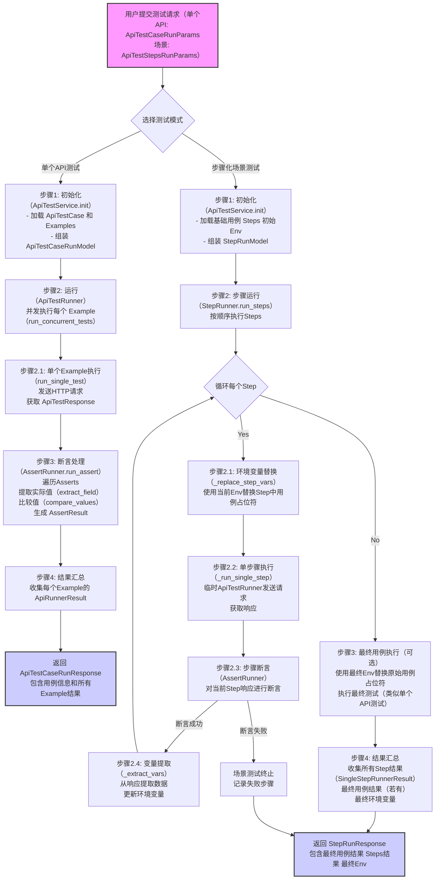

# JJ-AutoTestAPI: FastAPI 自动化接口测试平台

JJ-AutoTestAPI 是一个基于 FastAPI (后端) 和 Vue.js (前端) 构建的自动化接口测试平台。它允许用户定义、管理和执行API测试用例，支持单个API测试以及复杂的多步骤场景测试，并提供了清晰的测试结果展示。

## 主要特性

*   **强大的测试用例定义**: 支持详细定义请求方法、URL、请求头、查询参数、请求体和 Cookies。
*   **多数据驱动测试**: 通过 `Examples` 为单个API用例提供多组输入数据和预期断言。
*   **场景化/多依赖测试**: 通过 `Steps` 定义多步骤测试流程，支持步骤间的变量提取和传递。
*   **灵活的断言机制**: 支持对响应状态码、头部字段、响应体字段 (JSON路径提取) 和 Cookies 进行断言。
*   **并发执行**: 支持并发执行多个 `Example`，提高测试效率。
*   **环境变量管理**: 支持在测试过程中动态管理和使用环境变量。
*   **Web界面**: 提供友好的用户界面 (基于 Vue 3 + Element Plus) 进行测试用例管理和测试执行。

## 技术栈

*   **后端**: Python, FastAPI, Pydantic, SQLModel, HTTPX
*   **前端**: TypeScript, Vue 3, Vite, Pinia, Vue Router, Element Plus, Axios

## 项目结构概览

```
根目录/
├── autotest/         # 自动化测试核心模块 (后端)
│   ├── api/          # API端点定义
│   ├── crud/         # 数据库操作
│   ├── runner/       # 测试执行器 (ApiTestRunner, StepRunner, AssertRunner)
│   ├── schemas/      # Pydantic/SQLModel 数据模型 (请求/响应体)
│   └── service/      # 业务逻辑服务
├── common/           # 后端通用模块
│   ├── core/         # 核心配置、异常处理、安全等
│   ├── db/           # 数据库会话管理
│   ├── init/         # 应用初始化 (中间件、路由注册)
│   ├── main.py       # FastAPI 应用入口
│   ├── models/       # 数据库模型 (ORM)
│   └── utils/        # 通用工具函数
├── frontend/         # 前端应用 (Vue.js)
│   ├── public/       # 静态资源
│   ├── src/          # 前端源码
│   │   ├── api/      # API请求封装
│   │   ├── assets/   # 静态资源 (图片、字体等)
│   │   ├── components/ # Vue组件
│   │   ├── router/   # Vue Router配置
│   │   ├── store/    # Pinia状态管理
│   │   ├── views/    # 页面级组件
│   │   ├── App.vue   # 根组件
│   │   └── main.ts   # 前端入口
│   ├── index.html    # HTML入口文件
│   ├── package.json  # npm包管理
│   ├── vite.config.ts # Vite配置文件
│   └── tsconfig.json # TypeScript配置文件
├── system/           # 系统管理相关模块 (后端，例如用户、权限等)
├── requirements.txt  # Python依赖
└── README.md         # 项目说明文档
```
备注: 当前代码结构为 前端代码文件 嵌入到 后端代码中，仅为测试开发下使用，所有前端代码文件均在根目录下 <./frontend> 文件夹下，可单独存放。

## 环境搭建与运行

### 1. 后端 (FastAPI)

**环境要求:**
*   Python (推荐 3.10+ 版本)

**步骤:**
1.  **克隆项目** (如果尚未克隆)
    ```bash
    git clone https://github.com/Zijie933/JJ-AutoTestAPI.git
    ```
2.  **创建并激活虚拟环境** (推荐):
    ```bash
    python -m venv venv
    # Windows
    .\venv\Scripts\activate
    # macOS/Linux
    source venv/bin/activate
    ```
3.  **安装依赖**: (确保在项目根目录下执行)
    ```bash
    pip install -r requirements.txt
    ```
4.  **配置数据库**:
    *   根据 `common/core/config.py` 中的数据库配置，确保数据库服务已启动并正确配置连接参数。
    *   在后端项目运行启动时会自动创建数据库表，请根据文件配置详细建立 MYSQL 数据库。
5.  **启动服务**: (`common/main.py`)
    ```bash
    uvicorn common.main:app --host 0.0.0.0 --port 9101 --reload
    ```
    *   服务将运行在 `http://localhost:9101`。
    *   `--reload` 参数用于开发模式，代码变更时自动重启服务。

### 2. 前端 (Vue.js)

**环境要求:**
*   Node.js (推荐 LTS 版本，例如 18.x 或更高版本)
*   npm (Node.js 自带) 或 yarn

**步骤:**
1.  **进入前端目录**:
    ```bash
    cd frontend
    ```
2.  **安装依赖**:
    ```bash
    npm install
    # 或者使用 yarn
    # yarn install
    ```
3.  **开发环境运行**:
    ```bash
    npm run dev
    # 或者使用 yarn
    # yarn dev
    ```
    *   Vite 开发服务器将启动，默认监听在 `http://localhost:5173`。
    *   前端应用配置了代理，API请求会自动转发到后端服务 (`http://localhost:9101`)。具体代理规则见 <mcfile name="vite.config.ts" path="c:\Users\zijie\Desktop\腾讯mini接口自动化\learn_path\damo1\new_code\fastapi_demo1\frontend\vite.config.ts"></mcfile>。
        *   `/system/*` -> `http://localhost:9101/system/*`
        *   `/autotest/*` -> `http://localhost:9101/autotest/*`
4.  **构建生产版本**:
    ```bash
    npm run build
    # 或者使用 yarn
    # yarn build
    ```
    *   构建后的静态文件将输出到 `frontend/dist` 目录。
5.  **预览生产版本**:
    ```bash
    npm run preview
    # 或者使用 yarn
    # yarn preview
    ```

### 环境变量说明

*   **后端**: 主要配置通常在 `common/core/config.py` 中，可以通过环境变量覆盖。
*   **前端**: 开发环境变量位于 <mcfile name=".env.development" path="c:\Users\zijie\Desktop\腾讯mini接口自动化\learn_path\damo1\new_code\fastapi_demo1\frontend\.env.development"></mcfile>。
    *   `VITE_API_BASE_URL=http://0.0.0.0:9101`: 此变量定义了API的基础URL。在当前配置下，由于Vite代理的存在，前端代码中推荐使用相对路径 (如 `/autotest/run`) 发起API请求，以便请求能被代理正确转发。如果直接使用此`VITE_API_BASE_URL`拼接完整请求URL，需要确保其值与代理目标一致或请求路径能被代理规则捕获。

## 自动化测试框架核心概念

自动化测试框架位于 `autotest` 模块，其核心概念与流程如下：

### 1. 测试用例定义 (`ApiTestCase`)
定义单个API请求的详细信息，包括名称、URL、方法、请求头、查询参数、请求体和Cookies。

### 2. 测试数据/示例 (`Example`)
为 `ApiTestCase` 提供多组不同的输入数据和预期断言。每个 `Example` 可以覆盖或补充 `ApiTestCase` 中的字段，并包含独立的超时时间和断言列表。

### 3. 测试步骤 (`Step`)
用于定义多步骤的场景测试。每个步骤包含一个完整的 `ApiTestCase` 定义、针对该步骤的断言列表，以及可选的变量提取规则 (`extract`)。

### 4. 测试执行流程

*   **单个API测试**: 
    1.  加载 `ApiTestCase` 和 `Examples`。
    2.  <mcsymbol name="ApiTestRunner" filename="ApiTestRunner.py" path="autotest/runner/ApiTestRunner.py" startline="13" type="class"></mcsymbol> 并发执行每个 `Example`。
    3.  对每个 `Example` 的响应，<mcsymbol name="AssertRunner" filename="AssertRunner.py" path="autotest/runner/AssertRunner.py" startline="11" type="class"></mcsymbol> 执行预定义的断言。
    4.  返回详细的测试结果。

*   **步骤化/多依赖场景测试**: 
    1.  加载场景的初始信息、步骤列表 (`Steps`) 和初始环境变量。
    2.  <mcsymbol name="StepRunner" filename="StepRunner.py" path="autotest/runner/StepRunner.py" startline="17" type="class"></mcsymbol> 按顺序执行每个 `Step`。
    3.  在执行每个步骤前，使用当前环境变量替换步骤中用例定义的占位符。
    4.  执行步骤API请求，并进行断言。
    5.  如果步骤定义了 `extract` 规则且断言成功，则从响应中提取数据并更新环境变量。
    6.  所有步骤成功后，可以选择性地执行一个最终的API测试用例（使用最终的环境变量）。
    7.  返回包含所有步骤结果和最终环境变量的测试报告。



### 5. 主要API端点

*   `POST /autotest/run`: 执行单个/批量API测试 (基于 <mcsymbol name="ApiTestCaseRunParams" filename="api_test_schemas.py" path="autotest/schemas/api_test_schemas.py" startline="25" type="class"></mcsymbol>)。
*   `POST /autotest/run_steps`: 执行步骤化/多依赖场景测试 (基于 <mcsymbol name="ApiTestStepsRunParams" filename="api_test_schemas.py" path="autotest/schemas/api_test_schemas.py" startline="36" type="class"></mcsymbol>)。

### 6. 核心组件参考

*   **Runners**: <mcfolder name="autotest/runner" path="autotest/runner"></mcfolder> (包含 <mcsymbol name="ApiTestRunner" filename="ApiTestRunner.py" path="autotest/runner/ApiTestRunner.py" startline="13" type="class"></mcsymbol>, <mcsymbol name="StepRunner" filename="StepRunner.py" path="autotest/runner/StepRunner.py" startline="17" type="class"></mcsymbol>, <mcsymbol name="AssertRunner" filename="AssertRunner.py" path="autotest/runner/AssertRunner.py" startline="11" type="class"></mcsymbol>)
*   **Schemas**: <mcfolder name="autotest/schemas" path="autotest/schemas"></mcfolder> (Pydantic模型定义)
*   **CRUD**: <mcfolder name="autotest/crud" path="autotest/crud"></mcfolder> (数据库交互)
*   **Services**: <mcfolder name="autotest/service" path="autotest/service"></mcfolder> (业务逻辑)
*   **Models**: <mcfolder name="common/models" path="common/models"></mcfolder> (ORM模型)

## 如何使用

1.  **启动后端服务** (参见上文“后端环境搭建与运行”)。
2.  **启动前端服务** (参见上文“前端环境搭建与运行”)。
3.  在浏览器中打开前端应用 (默认为 `http://localhost:5173`)。
4.  通过Web界面创建和管理测试用例、场景，并执行测试。
5.  查看测试报告和结果。

## 贡献与反馈

欢迎提交 Pull Requests 或 Issues 参与项目贡献或反馈问题。

## 项目状态

*   **多依赖场景测试 (Steps 功能)**: 日期 2025/6/17 后已全部完成。
*   **定时自动测试**: 该功能正在积极开发中，目标是实现可配置的定时任务，自动执行指定的测试用例或场景，并生成报告。

